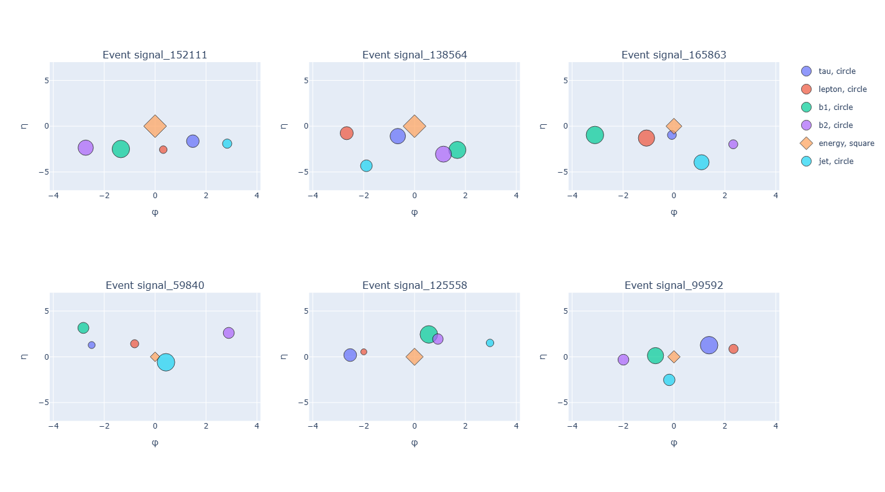

# di-Higgs Graph Dataset
Manipulate collision events from the di-Higgs production.

### TL;DR
The EventsDataset is a Pytorch Geometric Dataset. 

```python
from dataset import EventsDataset

graphs = EventsDataset(
            root='<select_root>',
            url='https://cernbox.cern.ch/s/8Oh5dfiB9K3qHnl/download',
            delete_raw_archive=False,
            add_edge_index=True,
            event_subsets={'signal': 100, 'singletop': 0, 'ttbar': 100},
)

```
> EventsDataset(200)

Each event is a graph with 5/6 nodes. Each node is built from the raw file as follows:

| Particle          | Feature 1 | Feature 2 | Feature 3   | 
|-------------------|-----------|-----------|-------------|
| tau               |  'pTj1'   | 'etaj1'   |   'phij1'   | 
| lepton            |  'pTj2'   | 'etaj2'   |   'phij2'   |
| b1                |  'pTb1'   | 'etab1'   |   'phib1'   | 
| b2                |  'pTb2'   | 'etab2'   |   'phib2'   | 
| ETMiss            |  'ETMiss' | 'nan'     | 'ETMissPhi' |
| jet               |  'pTj1'   | 'etaj1'   |   'phij1'   |


```python
g = graphs[0]
print(g)
```

> Data(x=[6, 3], edge_index=[2, 30], y=[1], event_id='signal_152111')


```python
from visualize import plot_event_2d
plot_event_2d(graphs[100])
```


```python
a_list_of_graphs = [graphs[i] for i in range(0, 300, 30)]
plot_event_2d(a_list_of_graphs, show_energy=True, height=1500)
```



#### Credits
- Adapted from: https://github.com/alessiodevoto/sparticles
- Original Author: Alessio Devoto
